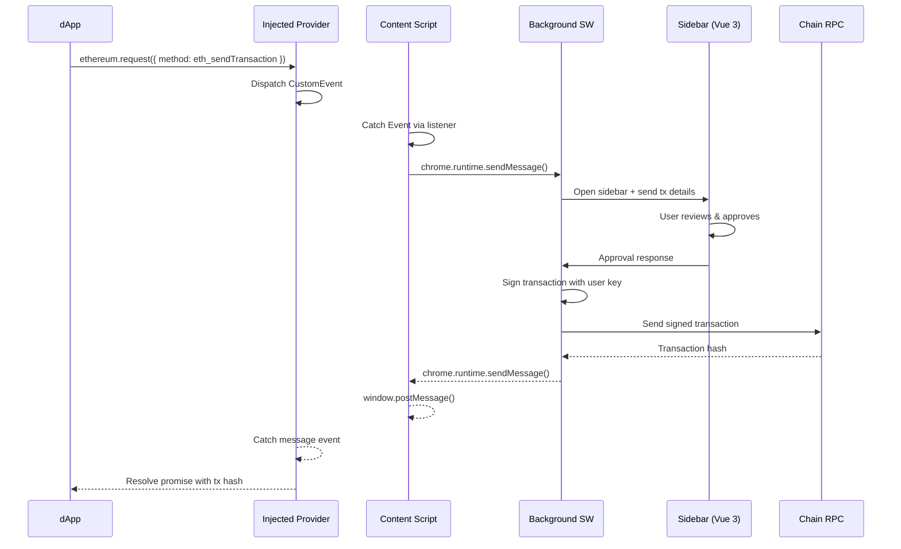

In 2024, I built a non-custodial multi-chain crypto wallet as a Chrome Extension sidebar. It supports 10+ blockchains, injects unified cross-chain balances into third-party DeFi applications like Aave, Uniswap, Lido, and Hyperliquid, and handles transaction signing, all from a sidebar panel that sits alongside the active tab. It reached 750+ users with a 4.7-star rating on Chrome Web Store during a crypto bear market.

This is the most technically complex frontend project I have ever built. Here is how it works, the architectural decisions I made, and what I learned.

[View on Chrome Web Store →](https://chromewebstore.google.com/detail/arcana-wallet/nieddmedbnibfkfokcionggafcmcgkpi)

## Why a sidebar, not a popup

Most crypto wallets use a popup window, a small overlay that appears when you click the extension icon. The popup disappears when you click anywhere else. This creates a fundamental UX problem for complex DeFi operations, the user cannot see the dApp and the wallet at the same time.

When you are approving a transaction on say Uniswap, you need to see the swap details (token pair, price impact, slippage) in the dApp while also reviewing the transaction parameters (gas price, value, contract address) in the wallet. With a popup wallet, you read the dApp details, memorize them, click the wallet popup, review the transaction, and hope you remembered correctly. With a sidebar wallet, both are visible simultaneously.

The sidebar form factor was a deliberate architectural decision from day one, not a feature we added later. It fundamentally changes the user experience for DeFi power users, which was our target audience.

Implementing a sidebar in a Chrome Extension means using a `side_panel` in Manifest V3. The sidebar runs as a separate page within the extension context, communicating with the content script and background service worker through Chrome's message passing API.

## The MetaMask compatibility problem

Here is the central technical challenge of building a crypto wallet extension: every dApp on the internet is built to work with MetaMask. When a dApp loads, it checks for `window.ethereum` ([EIP-1193](https://eips.ethereum.org/EIPS/eip-1193)), a provider object that MetaMask injects into every web page. The dApp calls methods like `eth_requestAccounts`, `eth_sendTransaction`, and `eth_sign` on this provider, and MetaMask handles the rest.

More recently, [EIP-6963](https://eips.ethereum.org/EIPS/eip-6963) introduced Multi Injected Provider Discovery, a standard that allows multiple wallet extensions to coexist without fighting over `window.ethereum`. Instead of overwriting each other's provider, wallets dispatch `eip6963:announceProvider` events and dApps listen for them. We implemented both standards: EIP-1193 for legacy dApp compatibility and EIP-6963 for modern multi-wallet discovery.

If you are building a new wallet, you have two choices: invent your own provider API and hope dApps adopt it (they will not), or inject a MetaMask-compatible provider and make every existing dApp work with your wallet out of the box.

I chose the second option. This meant studying MetaMask's open-source codebase to understand exactly how their provider injection works, then building a compatible implementation from scratch.

### How provider injection works

The injection chain has four components:

**1. Content script.** This runs in the context of the web page. It injects a script tag into the page that creates the `window.ethereum` provider object. The content script also acts as a relay between the injected provider and the extension's background service worker.

```ts
// content-script.js (simplified)
const script = document.createElement("script");
script.src = chrome.runtime.getURL("injected-provider.js");
document.head.appendChild(script);

// Relay messages between the page and the background
window.addEventListener("message", (event) => {
  if (event.data.target === "arcana-wallet-contentscript") {
    chrome.runtime.sendMessage(event.data.payload);
  }
});

chrome.runtime.onMessage.addListener((message) => {
  window.postMessage(
    {
      target: "arcana-wallet-page",
      payload: message,
    },
    "*",
  );
});
```

**2. Injected provider script.** This runs in the page's JavaScript context (not the extension context). It creates the `window.ethereum` object that dApps interact with. Every method call on this object sends a message to the content script, which relays it to the background service worker.

```ts
// injected-provider.js (simplified)
class ArcanaProvider {
  async request({ method, params }) {
    return new Promise((resolve, reject) => {
      const id = crypto.randomUUID();

      window.addEventListener("message", function handler(event) {
        if (
          event.data.target === "arcana-wallet-page" &&
          event.data.payload.id === id
        ) {
          window.removeEventListener("message", handler);
          if (event.data.payload.error) {
            reject(event.data.payload.error);
          } else {
            resolve(event.data.payload.result);
          }
        }
      });

      window.postMessage(
        {
          target: "arcana-wallet-contentscript",
          payload: { id, method, params },
        },
        "*",
      );
    });
  }

  // MetaMask compatibility: legacy methods
  async enable() {
    return this.request({ method: "eth_requestAccounts" });
  }

  get selectedAddress() {
    return this._selectedAddress;
  }

  get chainId() {
    return this._chainId;
  }
}

window.ethereum = new ArcanaProvider();
```

**3. Background service worker.** This is the brain of the extension. It receives RPC requests from the content script, processes them (signing transactions, managing keys, connecting to chain RPC endpoints), and sends responses back. Under Manifest V3, this must be a service worker, not a persistent background page.

**4. Sidebar UI.** Built with Vue 3, the sidebar displays balances, transaction history, and confirmation dialogs. When a dApp requests a transaction, the background service worker sends a message to the sidebar, which shows the confirmation UI. The user approves or rejects, and the response flows back through the chain.

The full message flow for a single transaction looks like this:



The injected provider dispatches custom events which are caught by the content script's event listeners. The content script communicates with the background service worker and sidebar via Chrome's messaging APIs. This event-based approach avoids the need for `world: "MAIN"` in the manifest, keeping the extension's security model cleaner.

Five hops for a single RPC call. Every hop is asynchronous. Every hop can fail. Error handling at each boundary is critical.

## Manifest V3 constraints

Chrome deprecated Manifest V2 in favor of Manifest V3, which introduced several constraints that make wallet development harder.

**Service workers instead of background pages.** In MV2, the background page was a persistent process that stayed alive as long as the browser was open. In MV3, the background service worker is terminated after 30 seconds of inactivity. This means you cannot keep long-lived connections open, you cannot maintain in-memory state across idle periods, and you must handle the worker restarting at any time.

For a wallet, this is painful. The user's session state (which account is selected, which chain is active, pending transaction approvals) must be persisted to `chrome.storage` and restored when the service worker wakes up. Any in-flight RPC request when the worker terminates must be retried or gracefully failed.

## Unified balance management across 10+ chains

The wallet's signature feature is unified balance management, showing the user their total portfolio value across all 10+ supported chains as a single fiat-denominated number. Instead of seeing "0.5 ETH on Ethereum, 0.3 ETH on Arbitrum, 100 USDC on Optimism," the user sees "Total: $2,450."

This requires fetching token balances from 10+ different chains simultaneously, converting each balance to a fiat value using real-time price feeds, and aggregating the results. The challenges here are:

**RPC rate limits.** Each chain has its own RPC endpoint, and free-tier RPC providers (Alchemy, Infura, public endpoints) have rate limits. Fetching balances for 10 tokens across 10+ chains means 100+ RPC calls. I implemented request batching (using viem's `multicall` where supported) and staggered fetching to stay within rate limits and also leveraged Ankr's multichain APIs to reduce the number of RPC calls later on.

**Price feed reliability.** Token prices come from price oracles like Chainlink. If the price feed is down or returns stale data, the unified balance becomes inaccurate. I implemented a multi-source price feed with fallbacks (Coinbase price api) and staleness detection.

**Real-time updates.** When a user completes a transaction on one chain, their balance on that chain changes. The UI must update within seconds, not minutes. I used a combination of block subscription (listening for new blocks on each chain and checking if any include the user's transactions) and optimistic updates (immediately reflecting the expected balance change in the UI, then confirming with the actual on-chain balance).

I built all of this using viem and TypeScript. Viem's multicall support and chain configuration system made multi-chain development significantly easier than it would have been with ethers.js.

## dApp injection: making Aave think we are MetaMask

The most technically interesting feature is dApp injection. When a user visits Aave, Uniswap, or Lido with our wallet extension, the dApp sees unified balances from all the supported chains, even though the dApp only supports one chain at a time.

For example, a user on Aave (Ethereum mainnet) might have USDC spread across 5 chains. Without our injection, Aave only sees the USDC on Ethereum. With our injection, Aave sees the user's entire USDC balance as if it were all on Ethereum.

How does this work? We had to intercept balance queries at two distinct layers, because different dApps fetch balances in different ways.

### Layer 1: Network call interception

Many dApps fetch balances by making HTTP requests directly to public RPC endpoints (Alchemy, Infura, or their own hosted nodes) rather than going through the wallet provider. Since these are read-only calls that do not require wallet signatures, we intercepted these network requests, decoded the calldata using ABI definitions, and injected unified balance responses.

### Layer 2: Wallet provider interception

Other dApps route balance queries through the wallet's own provider (`window.ethereum`). When a dApp calls `ethereum.request({ method: 'eth_getBalance' })` or `ethereum.request({ method: 'eth_call' })` targeting a `balanceOf` method, the request flows through our injected provider. We intercept these at the provider level before they reach the RPC endpoint.

### Mixed usage

Some dApps use a combination of both approaches, fetching some balances via direct network calls and others through the wallet provider. We had to handle both interception layers simultaneously to ensure consistent unified balances regardless of how the dApp chose to query them.

At both layers, the interception covers the same three categories of RPC calls:

**`eth_getBalance`**: We return the aggregated native token balance across all supported chains instead of just the balance on the current chain.

**`eth_call` targeting `balanceOf`**: We decode the calldata using the ERC-20 ABI, identify the token contract and the queried address, and return the aggregated balance of that token across all chains. The result is ABI-encoded and sent back as if it came from the original source.

**Multicalls**: Many DeFi dApps batch multiple `balanceOf` calls into a single multicall contract invocation for efficiency. We decode the multicall payload, identify each individual balance query within it, inject the unified balances for each, re-encode the results into the multicall response format, and return the modified response.

The dApp has no idea the responses have been modified. Whether the balance came from a direct network request or a wallet provider call, it receives properly ABI-encoded data that looks identical to a normal response, except the balances reflect the user's entire cross-chain portfolio. When the user initiates a transaction that requires more funds than are available on the current chain, the extension automatically bridges or swaps the required amount from other chains in the background before executing the transaction.

This is chain abstraction at the wallet level, the user does not need to know or care which chain their tokens are on. They just see a total and transact.

## What I would do differently

**Start with fewer chains.** We launched with 10+ chains because the marketing narrative demanded it. In practice, 80% of user activity was on 4-5 chains. Starting with 5 chains and adding more based on user demand would have halved the initial development time and testing burden.

**Invest more in error states.** Cross-chain operations have many failure modes: RPC timeouts, insufficient gas on the destination chain, bridge delays, price slippage. I handled all of these, but the error messages could have been more user-friendly. "Transaction failed: insufficient funds for gas" is technically accurate but does not help a non-technical user understand that they need to bridge ETH to Arbitrum before they can swap tokens there.

**Build the SDK extraction earlier.** The wallet technology was eventually extracted into a standalone TypeScript SDK for B2B distribution. If I had architected with SDK extraction in mind from day one, the separation would have been cleaner. Instead, I had to refactor the wallet-specific UI logic away from the core chain abstraction logic during the extraction process.

## The result

750+ users with a 4.7 star rating on Chrome Web Store, achieved during a crypto bear market where overall wallet adoption declined industry-wide. The core technology was extracted into a TypeScript SDK that became the foundation of Avail's Nexus chain abstraction product. Three team members, including myself, were invited to Dubai for two months to plan and ship this product.

Building a wallet extension is one of the hardest frontend projects in crypto. You are dealing with cryptographic key management, multi-chain network communication, real-time state synchronization, provider injection into hostile DOM environments, Manifest V3 constraints, and high-stakes UX where a bug can mean lost funds. It is also one of the most rewarding, there is nothing quite like watching a dApp that was built for MetaMask work seamlessly with a wallet you built from scratch.

---

_Written by [Shrinath Prabhu](https://shrinath.me), Senior Staff Frontend Engineer at [Avail Project](https://availproject.org). I have shipped 4 Chrome Extensions to the Chrome Web Store with a 100% approval rate. Detailed case studies at [shrinath.me/work](https://shrinath.me/work/)._
