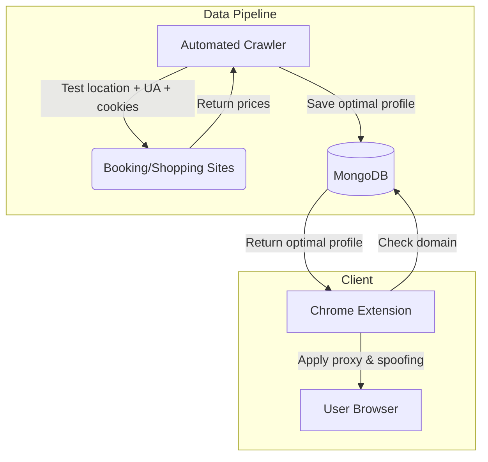

Booking a flight from India costs differently than booking the same flight from Albania. Shopping for headphones on a Mac shows different prices than shopping on a Linux machine. Visiting the same hotel booking site with cookies from a previous visit shows higher prices than visiting in a fresh browser session.

This is dynamic pricing, and in 2019, we built a Chrome Extension called Pricinger to fight it.

## The problem

Dynamic pricing algorithms use everything they can learn about you to maximize the price you pay. Your IP address reveals your country and approximate income level. Your user agent reveals your operating system and device (Apple users historically see higher prices). Your cookies reveal whether you have visited before (return visitors are shown higher prices because they have demonstrated intent). Your battery level on mobile can even influence pricing, low battery suggests urgency.

Most users have no idea this is happening. They see a price and assume it is the price. It is not. It is their price, calculated specifically for them based on signals they did not consent to sharing.

## What we built

Pricinger was a Chrome Extension with a multi-layered privacy system designed to strip these signals before they reach the pricing algorithm.

The core architecture had several components working together. Multi-region VPN proxies were the foundation, Node.js backends deployed across AWS regions in Albania, Slovenia, India, and Greece. When a user visits a booking or shopping site, the extension routes their traffic through the optimal proxy server, making them appear to be browsing from a country where prices are typically lower. The choice of countries was deliberate: Albania and Slovenia consistently showed lower prices across major booking platforms in our testing.

Beyond location spoofing, the extension handled geolocation blocking (preventing sites from requesting GPS coordinates through the browser API), user agent manipulation (making Apple users appear as Linux users, desktop users as mobile users, and vice versa, whichever combination produced lower prices for that specific site), cookie and local storage clearance (wiping tracking data so the site treats you as a first-time visitor), DNT header enforcement, and ad blocking (removing tracking pixels that feed dynamic pricing models).

## The smart optimization system

The most technically interesting piece was not the privacy controls themselves, it was the automated optimization system.

Every booking and shopping site responds differently to different combinations of privacy settings. Site A might give the best prices when you appear to be from Albania on a Linux machine. Site B might give the best prices when you appear to be from Slovenia on mobile with no cookies. Testing every combination manually is impractical.

So we built a crawler and scraper system that automated this process. The crawler visited major booking and shopping sites regularly, tested different combinations of privacy settings (location, user agent, cookie state), recorded the resulting prices, and stored the optimal configuration per-site in a MongoDB database.

When a user with Pricinger installed visited a supported site, the extension checked the database for that domain. If an optimal configuration existed, the user could apply it with a single click via the "Optimize" button. If no database entry existed (for less popular sites), the extension applied a sensible default configuration that worked well in most cases.

## The outcome

The extension reached approximately 1,000 users with a 4-star rating and over 50 reviews. It was built for a German client who self-funded the project. When COVID hit in 2020, travel bookings collapsed, the client's budget was cut, and Pricinger was discontinued.

The technical foundation, multi-region proxy deployment, automated web scraping at scale, Chrome Extension architecture with complex privacy controls, became the basis for my later Chrome Extension work. I went on to build three more extensions, including a non-custodial crypto wallet supporting 10+ blockchains. The privacy engineering instincts I developed on Pricinger directly influenced my later work on client-side encryption (Skizzle, Credenstore) and privacy-first analytics (Outline Analytics).

Sometimes the projects that teach you the most are the ones that do not survive.

---

_Written by [Shrinath Prabhu](https://shrinath.me), Senior Staff Frontend Engineer. Case studies at [shrinath.me/work](https://shrinath.me/work/)._
