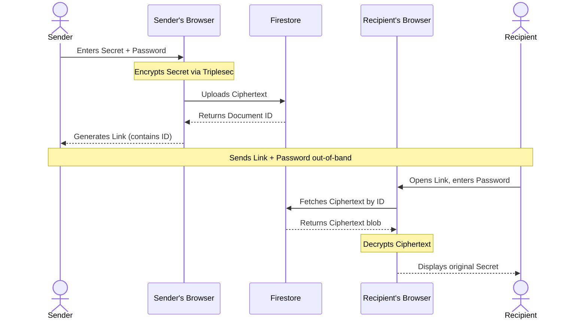

In 2020, I needed a way to share secrets: API keys, passwords, private notes, with teammates without sending them in plain text over Slack or email. Every existing tool either required an account (1Password, Bitwarden), needed a backend server (self-hosted Vault), or was a paid service.

So I built Credenstore, a zero-knowledge encrypted storage application that runs entirely in the browser, requires no login, no backend server, and stores only ciphertext that nobody (including me) can decrypt without the password.

[Try it →](https://credenstore.web.app)

## How it works

The entire security model rests on one principle: **the encryption key never leaves the client.**

When a user enters their secret data and a password, the browser encrypts the data using Triplesec, a symmetric encryption library that layers three ciphers (XSalsa20, Twofish, and AES) for defense in depth. The encrypted blob is uploaded to Firebase Firestore. Firestore returns a document ID, which is combined with the app URL to create a shareable link.

The link contains the document ID but not the password. The password exists only in the sender's memory and is communicated separately (over a phone call, in person, via a different channel). When the recipient opens the link, they enter the password, the browser downloads the encrypted blob from Firestore, decrypts it client-side using the password, and displays the original data.

At no point does Firestore or anyone with access to Firestore see the plaintext data. The server is a dumb storage layer for ciphertext. Even if someone compromises the database, they get encrypted blobs that are computationally infeasible to decrypt without the password (unless the password is literally weak and guessable or they have the password via social engineering).

## The design decisions

**No login required.** Authentication adds complexity, creates a user database (which is itself a security liability), and forces users to create yet another account. Credenstore sidesteps all of this by tying security to the password alone, not to a user identity. The tradeoff is that there is no account recovery, if you forget the password, the data is gone. For the use case (sharing temporary secrets), this is acceptable.

**Triplesec over Web Crypto API.** The Web Crypto API is built into browsers and is the "correct" modern approach. I chose Triplesec because it layers three independent ciphers, if one is ever found to have a vulnerability, the other two still protect the data. For a tool specifically designed to store secrets, defense in depth justified the slightly larger library size.

**Time-bound expiry.** Users can set an expiration duration when creating a secret. After the specified time, the Firestore document is automatically deleted via Firestore's TTL feature. This ensures that shared secrets do not persist indefinitely, a common security concern with tools like Pastebin where shared data lives forever.

**File support.** Beyond text secrets, users can encrypt and share files. The file is encrypted client-side, uploaded as a blob, and when the recipient enters the correct password, the decrypted file downloads directly to their machine rather than displaying in the browser. This prevents the decrypted content from ever being visible in the DOM.

## What this pattern enables

The Credenstore architecture, client-side encryption, dumb server storage, password-based access is applicable far beyond sharing secrets. Private note-taking apps, encrypted bookmarks, personal journals, medical records sharing, legal document exchange, any use case where data needs to be stored remotely but readable only by authorized parties.

The key insight is that you do not need a backend to build secure applications. You need a storage layer (Firestore, S3, or any blob store) and client-side encryption. The browser is powerful enough to handle the cryptography. The server just holds the ciphertext.

---

_Written by [Shrinath Prabhu](https://shrinath.me), Senior Staff Frontend Engineer. More projects at [shrinath.me/work](https://shrinath.me/work/)._
